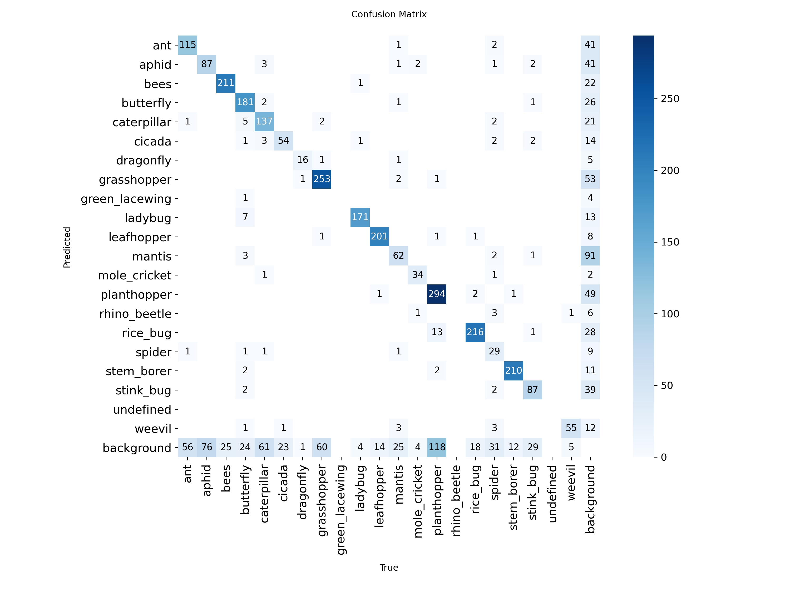
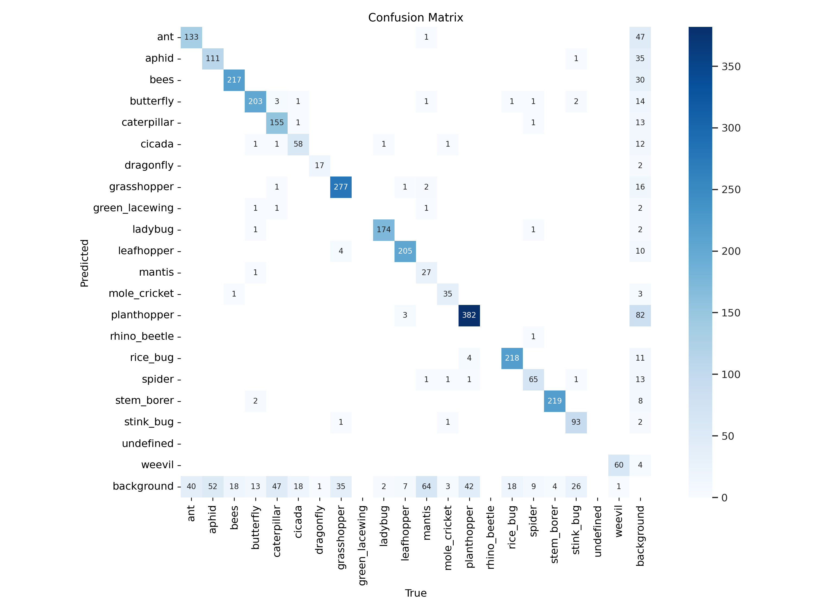
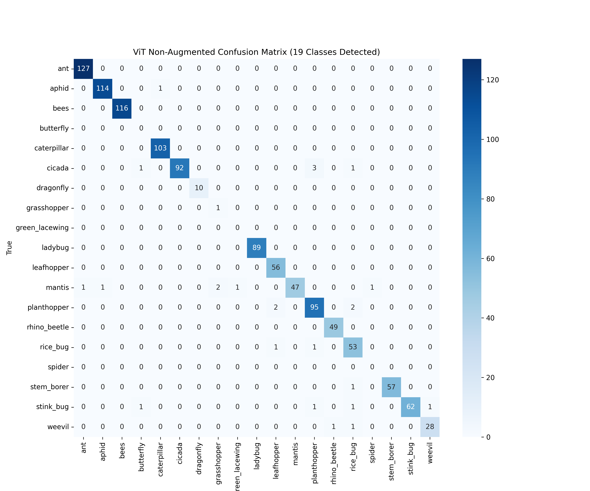
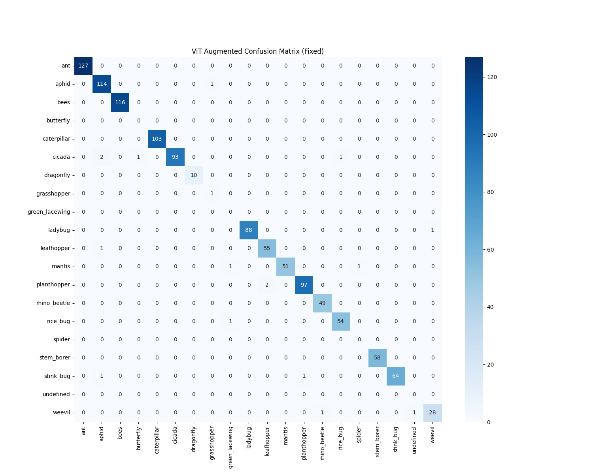
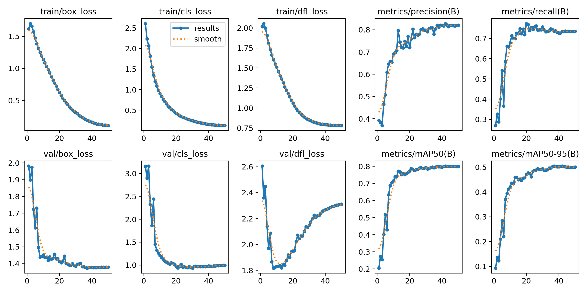
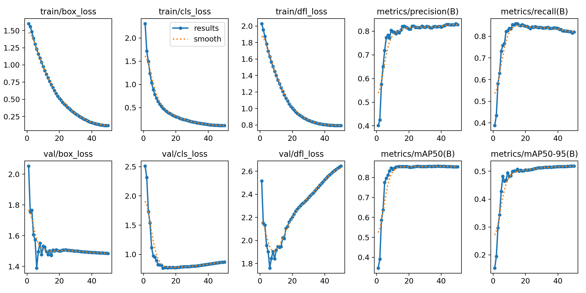

# 🐝 Hybrid Insect Detection & Smart Agricultural AI Consultant

This project presents a state-of-the-art hybrid AI solution for identifying agricultural insects and providing expert-level farming advice. It combines the speed of **YOLOv8**, the precision of **Vision Transformers (ViT)**, and the reasoning power of **Google Gemini 2.0 Flash**.

## 🏗️ System Architecture
- **Detection (Localization):** YOLOv8m identifies insect coordinates in the field.
- **Classification (Diagnosis):** A fine-tuned Vision Transformer (ViT) classifies species with **99% accuracy**.
- **Decision Support (LLM):** Google Gemini 2.0 Flash generates professional reports based on the insect category (Harmful, Beneficial, or Neutral).

## 📊 Performance & Data Science Experiment
We evaluated the impact of data augmentation on model performance, scaling the dataset from **19,000** to **45,500 images**.

### YOLOv8 Detection Performance
| Baseline (19k Images) | Optimized (45.5k Images) |
| :---: | :---: |
|  |  |
| *Initial class confusion* | *Clear diagonal separation* |

### Vision Transformer (ViT) Classification
| ViT Baseline | ViT Augmented (Fixed) |
| :---: | :---: |
|  |  |

### Training Metrics (Loss & Precision)
| Baseline Metrics | Augmented Metrics |
| :---: | :---: |
|  |  |

## 📂 Repository Structure
- `/notebooks`: Contains Baseline and Augmented pipeline notebooks.
- `/results`: Evaluation matrices, training logs, and performance dashboards.
- `/models`: Technical specifications and external hosting for weights.
- `/docs`: Supplementary documentation and `.gitkeep` files.

## 🔗 Links & Resources
- **Trained Model Weights (Google Drive):** [Download "proje_model" Folder Here](https://drive.google.com/drive/folders/1pA1X1xzFEiqZ38rm4fWkWOxOI_S2SDX2?usp=sharing).
- **Baseline Notebook:** .
- **Optimized (Augmented) Notebook:** .

---

### 🛡️ Execution & Integrity
- **Notebook Rendering:** If GitHub shows "Unable to render code block", please use the **"Open in Colab"** badges above to view and run the code interactively.
- **Data Safety:** The Google Drive link is set to **Viewer** mode to prevent unauthorized modifications.
- **API Keys:** Users must provide their own `GEMINI_API_KEY` to generate reports.

---
*Developed as part of an advanced AI research project focusing on smart agriculture and pest management.*
